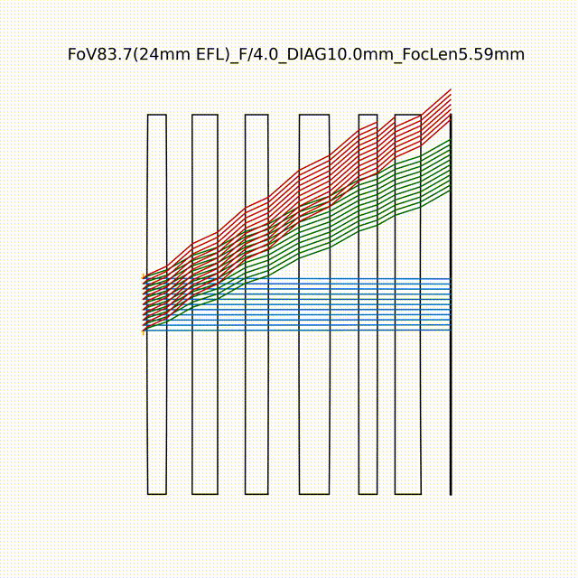
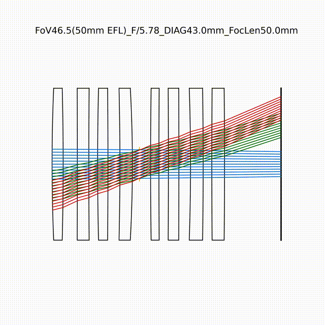
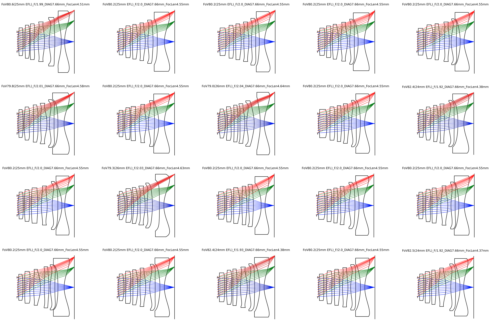
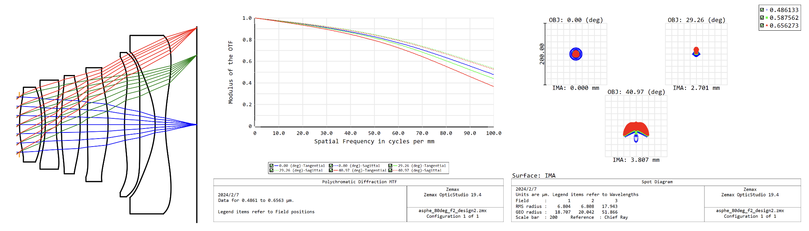

# AutoLens

AutoLens is an open-source automated lens design framework that uses gradient backpropagation and deep learning techniques to optimize optical systems from scratch. Built on top of the [DeepLens](https://github.com/singer-yang/DeepLens) framework, AutoLens aims to provide a modern, AI-driven approach to optical design.

## News

**[01/21/2025]** Please use the automated lens design examples in the DeepLens repository, as we currently don't have enough resources to maintain this repository. We are working on ways to extend and improve this project.

## About

AutoLens is being developed as open-source lens design software, aiming to provide capabilities similar to commercial tools like Zemax. The project incorporates advanced algorithms including end-to-end lens design and implicit representation techniques, with ongoing updates in the DeepLens framework.

We welcome contributions from the community! If you're interested in optical design and AI, please contact Xinge Yang at xinge.yang@kaust.edu.sa.

## Getting Started

### Method 1: Local Installation
1. Clone or download this repository
2. Run `python autolens.py`

### Method 2: Google Colab
[](https://colab.research.google.com/github/singer-yang/AutoLens/blob/main/autolens.ipynb)

### Method 3: Packaged Executable (Coming Soon)
We are working on a packaged .exe version for easier deployment.

## Lens Design Examples

### Example 1: Wide-Angle Lens
- Field of View: 80°
- F-number: 2.0
- Focal Length: 4.55mm



### Example 2: Full-Frame Lens
- Field of View: Full-frame
- F-number: 3.0
- Focal Length: 50mm



### Example 3: Randomized Designs
20 random automated lens design results for FoV 80°, F/2.0, 4.55mm focal length.



### Example 4: Aspherical Lens
An aspherical lens demonstrating outstanding optical performance.



## Citation

If you find this repository helpful, please cite our paper:

```bibtex
@article{yang2023curriculum,
  title={Curriculum learning for ab initio deep learned refractive optics},
  author={Yang, Xinge and Fu, Qiang and Heidrich, Wolfgang},
  journal={arXiv preprint arXiv:2302.01089},
  year={2023}
}